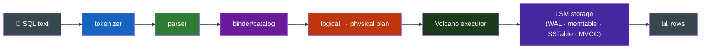
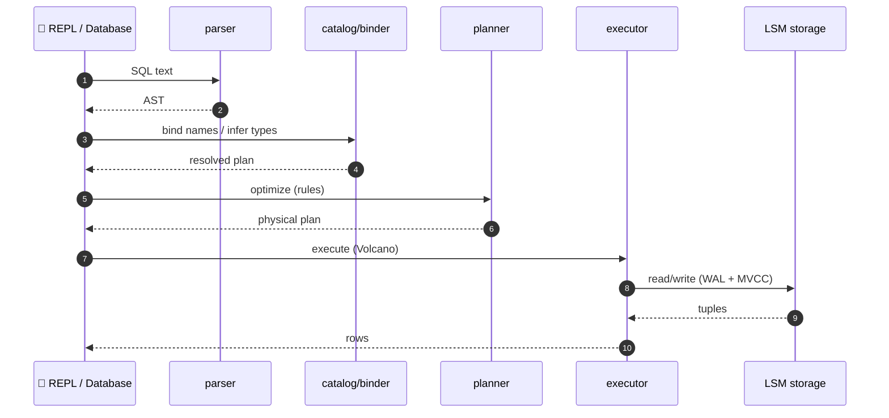

<div align="center">

**🌐 Choose Language / Selecione o Idioma / Elija el Idioma**

[](README.md)&nbsp;&nbsp;&nbsp;[](README_PT.md)&nbsp;&nbsp;&nbsp;[](README_ES.md)

</div>

---

<div align="center">

```
████████╗██╗████████╗ █████╗ ███╗   ██╗███████╗ ██████╗ ██████╗  ██████╗ ███████╗
╚══██╔══╝██║╚══██╔══╝██╔══██╗████╗  ██║██╔════╝██╔═══██╗██╔══██╗██╔═══██╗██╔════╝
   ██║   ██║   ██║   ███████║██╔██╗ ██║█████╗  ██║   ██║██████╔╝██║   ██║█████╗
   ██║   ██║   ██║   ██╔══██║██║╚██╗██║██╔══╝  ██║   ██║██╔══██╗██║   ██║██╔══╝
   ██║   ██║   ██║   ██║  ██║██║ ╚████║███████╗╚██████╔╝██║  ██║╚██████╔╝███████╗
   ╚═╝   ╚═╝   ╚═╝   ╚═╝  ╚═╝╚═╝  ╚═══╝╚══════╝ ╚═════╝ ╚═╝  ╚═╝ ╚═════╝ ╚══════╝
        Four large systems, written from scratch in real TypeScript, in one monorepo
```

---

[](https://www.typescriptlang.org/)
[]()
[](LICENSE)
[]()
[]()

<br/>

> **An embedded SQL database, an observability platform, a full-stack web framework and**
> **a browser IDE — each written from scratch, none built on top of an existing database,**
> **framework or IDE. Inspiration, not dependency.**

<br/>


</div>

---

## 📑 Table of Contents

<details>
<summary>▶️ <strong>Click to expand / collapse this section</strong></summary>

<table>
<tr>
<td valign="top" width="50%">

**🏗️ System**
- [Overview](#-overview)
- [System Architecture](#-system-architecture)
- [Technology Stack](#-technology-stack)
- [Design Patterns](#-design-patterns-applied)
- [Project Structure](#-project-structure)

**📦 Modules**
- [SQL Engine](#-sql-engine)
- [Observability](#-observability)
- [Web Framework](#-web-framework)
- [Browser IDE](#-browser-ide)
- [Design Decisions (ADRs)](#design-decisions-addressed)

</td>
<td valign="top" width="50%">

**💼 Business**
- [Business Rules](#-business-rules)
- [Functional Requirements](#-functional-requirements)
- [Non-Functional Requirements](#-non-functional-requirements)

**📐 Design**
- [Data Model](#-data-model)
- [System Flows](#-system-flows)
- [SQL Statement Flow](#sql-statement-flow)
- [Scope Substitutions](#scope-substitutions)

**🔐 Security & Ops**
- [Security](#-security)
- [Installation & Execution](#-installation--execution)
- [Automated Tests](#-automated-tests)
- [Metrics & Monitoring](#-metrics--monitoring)
- [Known Limitations](#-known-limitations)

</td>
</tr>
</table>

---

</details>

## 🌟 Overview

<details>
<summary>▶️ <strong>Click to expand / collapse this section</strong></summary>

**TitanForge** — four large systems, written from scratch in real TypeScript, in one monorepo.

An embedded SQL database (tokenizer → parser → binder/catalog → rule-based planner → Volcano executor → LSM storage with a real WAL and real MVCC) is the flagship. Alongside it: an observability platform (OTLP traces, a real columnar span store, a hand-written query language), a full-stack web framework with its own `ts-morph`-based compiler (file-based routing, real type-safe data loaders, streaming SSR), and a browser IDE (Monaco, a real TypeScript language service, a virtual filesystem, a scoped shell, a real Debug Adapter Protocol implementation).

Nothing here is built on top of an existing database, framework, or IDE — inspiration, not dependency.

### ✅ Status

Every milestone in `docs/ROADMAP.md` is complete: **717 tests, all passing**, lint clean, `tsc -b` clean across all 22 packages. Every deliberate scope reduction is stated plainly in `docs/ROADMAP.md` and the ADRs — every one is a genuinely working system in its own right, just narrower than the thing it stands in for. Nothing in this README describes something that is not in the repository.

### 🎯 System Objectives

| Objective | Description |
|-----------|-------------|
| 🗄️ **Embedded SQL database** | full pipeline: tokenizer → parser → catalog → planner → executor → LSM storage |
| 📈 **Observability platform** | OTLP traces, columnar span store, hand-written query language, flamegraph |
| 🕸️ **Full-stack framework** | ts-morph compiler, file routing, type-safe loaders, streaming SSR, dev server |
| 🧪 **Browser IDE** | Monaco + TS language service, VFS, scoped shell, real DAP implementation |
| 📐 **One monorepo, zero shared code** | four independent products, shared conventions |
| 🤝 **Honest about scope** | every substitution documented as an ADR, never faked |

---

</details>

## 🏗️ System Architecture

<details>
<summary>▶️ <strong>Click to expand / collapse this section</strong></summary>

### Four Independent Products

```mermaid
flowchart TB
    subgraph SQL["🗄️ SQL — flagship"]
        P1["parser"] --> C1["catalog/binder"]
        C1 --> PL1["planner (rule-based)"]
        PL1 --> E1["executor (Volcano)"]
        E1 --> S1["storage-api / memory / lsm (WAL+MVCC)"]
        E1 --> F1["engine (Database facade) + cli (REPL)"]
    end

    subgraph OBS["📈 Observability"]
        P2["OTLP ingestion"] --> S2["columnar span store"]
        S2 --> Q2["hand-written query language"]
        Q2 --> U2["service map + anomaly + flamegraph"]
    end

    subgraph WEB["🕸️ Web framework"]
        P3["ts-morph compiler"] --> R3["file routing + loaders + SSR"]
        R3 --> D3["esbuild + WebSocket dev server / HMR"]
    end

    subgraph IDE["🧪 Browser IDE"]
        P4["virtual filesystem"] --> L4["ts.LanguageService + Monaco"]
        L4 --> SH4["scoped shell + DAP + toy interpreter"]
    end

    style SQL fill:#1e3a5f,color:#fff,stroke:#4a90d9
    style OBS fill:#1a3a1a,color:#fff,stroke:#4caf50
    style WEB fill:#3a1a1a,color:#fff,stroke:#e57373
    style IDE fill:#2a1a3a,color:#fff,stroke:#ce93d8
```



### Layered Design (SQL)



---

</details>

## 🛠️ Technology Stack

<details>
<summary>▶️ <strong>Click to expand / collapse this section</strong></summary>

| Layer | Technology | Purpose |
|-------|-----------|---------|
| 🧠 **Language** | TypeScript | all 22 packages |
| 📦 **Workspaces** | npm workspaces | one monorepo, independent products |
| 🧪 **Tests** | Vitest | 717 tests across every package |
| 🧹 **Lint** | ESLint | clean across all packages |
| 🔍 **Build** | `tsc -b` | type-check clean across all packages |
| 🏗️ **SQL engine** | @titanforge/engine | Database facade + LSM storage |
| 🌐 **Observability** | OTLP/JSON | columnar span store + query language |
| 🕸️ **Web compiler** | ts-morph | file routing + type-safe loader extraction |
| 🧪 **IDE** | Monaco + ts.LanguageService | browser editing + language features |

---

</details>

## 📐 Design Patterns Applied

<details>
<summary>▶️ <strong>Click to expand / collapse this section</strong></summary>

| Pattern | Where | Rationale |
|---------|-------|-----------|
| 🗃️ **Pipeline / stage decomposition** | SQL tokenizer → parser → catalog → planner → executor → storage | each stage transforms the previous without coupling |
| 🧩 **Discriminated-union AST** | SQL parser | type-safe, exhaustive pattern matching |
| 🗄️ **Rule-based optimizer** | SQL planner | every rule is a provable Pareto improvement (ADR 4) |
| ⚙️ **Volcano iterator model** | SQL executor | pull-based streams compose arbitrarily |
| 📦 **MVCC transaction model** | SQL storage-api contract | multi-version concurrency across engines |
| 🏗️ **Compiler over generator** | parser + web compiler hand-built | full control, no opaque generator |
| 🖼️ **WAL + memtable + SSTable** | LSM storage | durability, writes, compaction |
| 🤝 **Honest scope substitution ADRs** | cross-cutting | every narrowing documented, never faked |

---

</details>

## 📁 Project Structure

<details>
<summary>▶️ <strong>Click to expand / collapse this section</strong></summary>

```
titanforge/
│
├── 📄 package.json / tsconfig.json / vitest.config.ts / eslint.config.js
├── 📄 tsconfig.base.json
├── 📄 README.md                   # 🇺🇸 English (primary)
├── 📄 README_PT.md                # 🇧🇷 Português
├── 📄 README_ES.md                # 🇪🇸 Español
│
├── 📂 packages/
│   ├── 📂 sql/                    # embedded SQL database (flagship, 411 tests)
│   │   ├── parser · catalog · planner · executor · engine · cli
│   │   └── storage-api · storage-memory · storage-lsm
│   ├── 📂 observability/          # traces, metrics, logs (110 tests)
│   ├── 📂 webstack/               # full-stack framework + compiler (162 tests)
│   │   └── example/              # working example app
│   └── 📂 ide/                    # browser IDE (145 tests)
│
├── 📂 docs/
│   ├── 📄 ARCHITECTURE.md        # how one SQL statement flows text → rows
│   ├── 📄 ROADMAP.md             # milestones, scope and per-product specs
│   └── 📂 adr/
│       ├── 0001-monorepo-four-independent-products.md
│       ├── 0002-hand-written-parsers.md
│       ├── 0003-schema-catalog-as-a-system-table.md
│       ├── 0004-rule-based-not-cost-based-optimizer.md
│       └── 0005-honest-scope-substitutions.md
```

---

</details>

## 📦 System Modules

<details>
<summary>▶️ <strong>Click to expand / collapse this section</strong></summary>

### 🗄️ SQL Engine

- `parser` — hand-written tokenizer + recursive-descent parser, discriminated-union AST.
- `catalog` — schema registry + binder: resolves names, infers types, expands `SELECT *`.
- `planner` — logical plan → rule-based optimizer (predicate/projection pushdown, join-strategy selection) → physical plan.
- `storage-api` — the `StorageEngine` interface + the shared MVCC contract.
- `storage-memory` — a real MVCC-correct in-memory engine.
- `storage-lsm` — a real WAL + memtable + SSTable + compaction engine.
- `executor` — Volcano-style physical executor, real 3-valued NULL logic.
- `engine` — the `Database` facade — `execute`/`executeScript`/`transaction`.
- `cli` — a REPL.

### 📈 Observability

OTLP/JSON ingestion → a real columnar span store → a hand-written query language (`service = "api" AND duration > 100`) → a service-map builder + anomaly detector → a Canvas-based flamegraph UI, plus an auto-instrumentation SDK that wraps `fetch`.

### 🕸️ Web Framework

`ts-morph`-based file-route discovery and type-safe loader extraction (a generated router file that itself type-checks with zero diagnostics), real out-of-order streaming SSR, an esbuild+WebSocket dev server with HMR, and a plugin system. A working example app lives at `packages/webstack/example`.

### 🧪 Browser IDE

A real tree-structured virtual filesystem, TypeScript's own `ts.LanguageService` wired to Monaco, a scoped terminal (`ls/cd/cat/mkdir/rm/run`, real command parsing including pipes and redirection), and a real Debug Adapter Protocol implementation proven against a from-scratch, breakpoint-capable toy-language interpreter.

---

</details>

## 📋 Business Rules

<details>
<summary>▶️ <strong>Click to expand / collapse this section</strong></summary>

| # | Rule | Enforcement |
|---|------|-------------|
| BR-01 | Nothing built on an existing database/framework/IDE | inspiration, not dependency |
| BR-02 | One monorepo, zero shared code between groups | shared conventions only (ADR 1) |
| BR-03 | Parsers are hand-written, not generated | full control (ADR 2) |
| BR-04 | Schema catalog persists as rows in a system table | fixed like SQLite's `sqlite_master` (ADR 3) |
| BR-05 | Optimizer is rule-based, not cost-based | every rule a provable Pareto improvement (ADR 4) |
| BR-06 | MVCC correctness is part of the storage contract | shared across memory and LSM engines |
| BR-07 | Scope substitutions are documented, never faked | honest ADRs for every narrowing (ADR 5) |
| BR-08 | Type safety is proven, not assumed | generated router file type-checks with zero diagnostics |
| BR-09 | Real docs omit nothing | "nothing here describes something not in the repo" |

---

</details>

## ✨ Functional Requirements

<details>
<summary>▶️ <strong>Click to expand / collapse this section</strong></summary>

| ID | Requirement | Priority | Status |
|----|-------------|----------|--------|
| **RF-01** | Tokenizer + recursive-descent parser → AST | 🔴 High | ✅ Implemented |
| **RF-02** | Binder/catalog: name resolution, type inference, `SELECT *` | 🔴 High | ✅ Implemented |
| **RF-03** | Rule-based optimizer with pushdown + join selection | 🔴 High | ✅ Implemented |
| **RF-04** | Volcano executor with 3-valued NULL logic | 🔴 High | ✅ Implemented |
| **RF-05** | LSM storage: WAL + memtable + SSTable + compaction | 🔴 High | ✅ Implemented |
| **RF-06** | Real MVCC across memory and LSM engines | 🔴 High | ✅ Implemented |
| **RF-07** | SQL REPL + `Database` facade (execute/executeScript/transaction) | 🟡 Medium | ✅ Implemented |
| **RF-08** | OTLP ingestion + columnar span store + query language | 🟡 Medium | ✅ Implemented |
| **RF-09** | Flamegraph UI + auto-instrumentation SDK | 🟡 Medium | ✅ Implemented |
| **RF-10** | File-based routing + type-safe loaders + streaming SSR | 🔴 High | ✅ Implemented |
| **RF-11** | Dev server with HMR + plugin system | 🟡 Medium | ✅ Implemented |
| **RF-12** | Monaco + ts.LanguageService + VFS + scoped shell + DAP | 🔴 High | ✅ Implemented |

---

</details>

## ⚙️ Non-Functional Requirements

<details>
<summary>▶️ <strong>Click to expand / collapse this section</strong></summary>

| ID | Category | Requirement | Target |
|----|----------|-------------|--------|
| **RNF-01** | 📦 Independence | zero reliance on existing DB/framework/IDE | from scratch |
| **RNF-02** | 🧪 Correctness | tests prove systems work | 717 tests passing |
| **RNF-03** | 🔍 Type safety | `tsc -b` clean | all 22 packages |
| **RNF-04** | 🧹 Lint clean | ESLint clean | every package |
| **RNF-05** | 🧩 Modularity | independent product groups, shared conventions | monorepo design |
| **RNF-06** | 📈 Scalability | LSM + columnar design for real data sizes | storage layers |
| **RNF-07** | 🤝 Honesty | every scope reduction documented | ROADMAP + ADRs |
| **RNF-08** | 🔍 Verifiability | claims reproducible from the repo | run tests/build to confirm |

---

</details>

## 🗄️ Data Model

<details>
<summary>▶️ <strong>Click to expand / collapse this section</strong></summary>

### SQL Pipeline Objects

| Stage | Output |
|-------|--------|
| Tokenizer | token stream |
| Parser | discriminated-union AST |
| Binder/Catalog | resolved, type-inferred schema |
| Planner | logical → physical plan |
| Executor | Volcano iterators, 3-valued NULL |
| Storage | WAL · memtable · SSTable · MVCC |

### Storage Layout (LSM)

| Component | Purpose |
|-----------|---------|
| WAL | durability for writes |
| Memtable | in-memory recent writes |
| SSTable | sorted immutable runs |
| Compaction | merges runs, bounds read amplification |
| MVCC | multi-version concurrency across engines |

### Observability Objects

| Object | Purpose |
|--------|---------|
| OTLP spans | trace telemetry |
| Columnar span store | analytical access |
| Query language | `service = "api" AND duration > 100` |
| Service map / anomaly / flamegraph | analysis & UI |

---

</details>

## 🔄 System Flows

<details>
<summary>▶️ <strong>Click to expand / collapse this section</strong></summary>

### SQL Statement Flow



### Scope Substitutions

| Substitution | Stands in for | Status |
|--------------|---------------|--------|
| real TS `LanguageService` | a WASM-cross-compiled one | ➕ Real, documented |
| scoped shell | WebContainers | ➕ Real, documented |
| toy-language interpreter | real V8 debugging | ➕ Real, breakpoint-capable |
| JSON-only OTLP | full OTLP protobuf | ➕ Real, documented |
| rule-based optimizer | cost-based optimizer | ➕ Provable Pareto improvements |

---

</details>

## 🔐 Security

<details>
<summary>▶️ <strong>Click to expand / collapse this section</strong></summary>

### Implemented Controls

| Control | Implementation |
|---------|---------------|
| 🛡️ **Type safety as a guard** | `tsc -b` clean; parsers and loaders typed |
| 🧱 **Scoped shell** | IDE terminal is scoped, with real `ls/cd/cat/mkdir/rm/run` |
| 🧪 **No shared-code attack surface** | four independent products, no cross-group dependency |
| 📚 **Documented, not faked** | honest ADRs ensure nothing overclaims |

### Known Security Considerations

| Consideration | Detail |
|---------------|--------|
| 🌐 **Dev server** | esbuild+WebSocket dev server is for development ships |
| 🗃️ **Data at rest** | embedded SQL engine stores data per its storage contract; operability is the consumer's |
| 🧪 **Toy interpreter** | the DAP demo interpreter is a toy language, not an arbitrary-code runtime |

---

</details>

## 🚀 Installation & Execution

<details>
<summary>▶️ <strong>Click to expand / collapse this section</strong></summary>

### Install & Verify

```bash
npm install
npm test          # 717 tests, every package
npm run lint
npm run build     # tsc -b across all 22 packages
```

### Run a Product Group

```bash
npx vitest run packages/sql           # 411 tests (SQL engine)
npx vitest run packages/observability # 110 tests
npx vitest run packages/webstack      # 162 tests
npx vitest run packages/ide           # 145 tests
```

### SQL REPL

```bash
npx tsx packages/sql/cli/src/main.ts           # interactive REPL
npx tsx packages/sql/cli/src/main.ts -f script.sql  # non-interactive
```

---

</details>

## 🧪 Automated Tests

<details>
<summary>▶️ <strong>Click to expand / collapse this section</strong></summary>

```bash
npm test          # 717 tests, all passing
npx vitest run packages/sql           # 411 tests
npx vitest run packages/observability # 110 tests
npx vitest run packages/webstack      # 162 tests
npx vitest run packages/ide           # 145 tests
```

Notable proofs:

| Claim | Proved by |
|-------|-----------|
| The SQL pipeline works end to end | integration tests against the real LSM engine |
| The generated router type-checks | its own test, zero diagnostics |
| The DAP works against a real debuggee | breakpoints on a from-scratch toy interpreter |
| The schema catalog persists | integration-tested against LSM, not just memory (ADR 3) |

---

</details>

## 📊 Metrics & Monitoring

<details>
<summary>▶️ <strong>Click to expand / collapse this section</strong></summary>

### Codebase Metrics

| Metric | Value |
|--------|-------|
| Packages | 22 |
| Products | 4 (SQL, observability, webstack, ide) |
| Tests total | 717 |
| SQL tests | 411 |
| Webstack tests | 162 |
| IDE tests | 145 |
| Observability tests | 110 |
| Lint | clean |
| `tsc -b` | clean |

### Monitoring (Observability product)

| Feature | Purpose |
|---------|---------|
| Columnar span store | analytical trace access |
| Query language | `service = "api" AND duration > 100` |
| Service-map builder | dependency discovery |
| Anomaly detector | outlier detection |
| Flamegraph UI | visual profile |

---

</details>

## ⚠️ Known Limitations

<details>
<summary>▶️ <strong>Click to expand / collapse this section</strong></summary>

| Category | Issue | Status |
|----------|-------|--------|
| 🗄️ **Rule-based optimizer** | not cost-based; no table statistics collected | ➕ Provable Pareto rules (ADR 4) |
| 🌐 **JSON-only OTLP** | not full OTLP protobuf | ➕ Real, documented substitution |
| 🧪 **Toy-language interpreter** | stands in for real V8 debugging | ➕ Real, breakpoint-capable (ADR 5) |
| 🖥️ **Scoped shell** | stands in for WebContainers | ➕ Real, documented (ADR 5) |
| 🔤 **Real LanguageService** | stands in for a WASM-cross-compiled one | ➕ Real, documented (ADR 5) |
| 📦 **No shared code** | four products independent by design | ➕ Convention over coupling (ADR 1) |

</details>

---

<div align="center">

---

### 🔨 TitanForge

*Four large systems, written from scratch in real TypeScript, in one monorepo.*

[]()
[]()
[]()
[]()

<br/>

```
"Nothing here describes something that is not in the repository."
```

</div>
