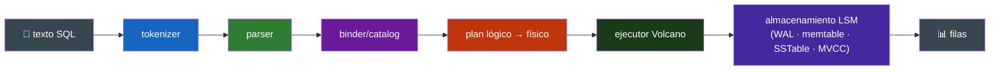
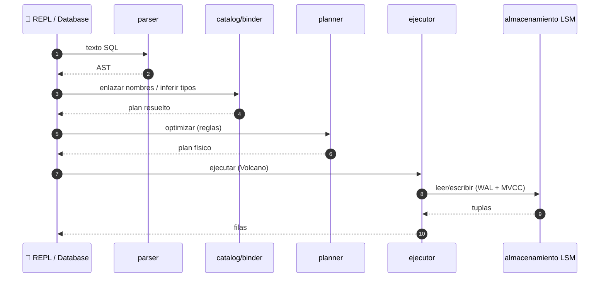

<div align="center">

**🌐 Choose Language / Selecione o Idioma / Elija el Idioma**

[](README.md)&nbsp;&nbsp;&nbsp;[](README_PT.md)&nbsp;&nbsp;&nbsp;[](README_ES.md)

</div>

---

<div align="center">

```
████████╗██╗████████╗ █████╗ ███╗   ██╗███████╗ ██████╗ ██████╗  ██████╗ ███████╗
╚══██╔══╝██║╚══██╔══╝██╔══██╗████╗  ██║██╔════╝██╔═══██╗██╔══██╗██╔═══██╗██╔════╝
   ██║   ██║   ██║   ███████║██╔██╗ ██║█████╗  ██║   ██║██████╔╝██║   ██║█████╗
   ██║   ██║   ██║   ██╔══██║██║╚██╗██║██╔══╝  ██║   ██║██╔══██╗██║   ██║██╔══╝
   ██║   ██║   ██║   ██║  ██║██║ ╚████║███████╗╚██████╔╝██║  ██║╚██████╔╝███████╗
   ╚═╝   ╚═╝   ╚═╝   ╚═╝  ╚═╝╚═╝  ╚═══╝╚══════╝ ╚═════╝ ╚═╝  ╚═╝ ╚═════╝ ╚══════╝
     Cuatro grandes sistemas, escritos desde cero en TypeScript real, en un monorepo
```

---

[](https://www.typescriptlang.org/)
[]()
[](LICENSE)
[]()
[]()

<br/>

> **Una base de datos SQL embebida, una plataforma de observabilidad, un framework web**
> **full-stack y un IDE de navegador — cada uno escrito desde cero, ninguno construido**
> **sobre una base de datos, framework o IDE existente. Inspiración, no dependencia.**

<br/>


</div>

---

## 📑 Índice de Contenidos

<details>
<summary>▶️ <strong>Haz clic para expandir / contraer esta sección</strong></summary>

<table>
<tr>
<td valign="top" width="50%">

**🏗️ Sistema**
- [Visión General](#-visi%C3%B3n-general)
- [Arquitectura del Sistema](#-arquitectura-del-sistema)
- [Stack Tecnológico](#-stack-tecnol%C3%B3gico)
- [Patrones de Diseño](#-patrones-de-dise%C3%B1o-aplicados)
- [Estructura del Proyecto](#-estructura-del-proyecto)

**📦 Módulos**
- [Motor SQL](#-motor-sql)
- [Observabilidad](#-observabilidad)
- [Framework Web](#-framework-web)
- [IDE de Navegador](#-ide-de-navegador)
- [Decisiones de Diseño (ADRs)](#decisiones-de-dise%C3%B1o-abordadas)

</td>
<td valign="top" width="50%">

**💼 Negocio**
- [Reglas de Negocio](#-reglas-de-negocio)
- [Requisitos Funcionales](#-requisitos-funcionales)
- [Requisitos No Funcionales](#-requisitos-no-funcionales)

**📐 Diseño**
- [Modelo de Datos](#-modelo-de-datos)
- [Flujos del Sistema](#-flujos-del-sistema)
- [Flujo de Statement SQL](#flujo-de-statement-sql)
- [Sustituciones de Alcance](#sustituciones-de-alcance)

**🔐 Seguridad y Operaciones**
- [Seguridad](#-seguridad)
- [Instalación & Ejecución](#-instalaci%C3%B3n--ejecuci%C3%B3n)
- [Pruebas Automatizadas](#-pruebas-automatizadas)
- [Métricas & Monitoreo](#-m%C3%A9tricas--monitoreo)
- [Limitaciones Conocidas](#-limitaciones-conocidas)

</td>
</tr>
</table>

---

</details>

## 🌟 Visión General

<details>
<summary>▶️ <strong>Haz clic para expandir / contraer esta sección</strong></summary>

**TitanForge** — cuatro grandes sistemas, escritos desde cero en TypeScript real, en un monorepo.

Una base de datos SQL embebida (tokenizer → parser → binder/catalog → planner basado en reglas → ejecutor Volcano → almacenamiento LSM con un WAL real y MVCC real) es la insignia. Junto a ella: una plataforma de observabilidad (traces OTLP, un almacenamiento de spans columnar real, un lenguaje de consulta escrito a mano), un framework web full-stack con su propio compilador basado en `ts-morph` (routing por archivo, data loaders realmente type-safe, SSR streaming), y un IDE de navegador (Monaco, un language service TypeScript real, un sistema de archivos virtual, un shell con alcance, una implementación real del Debug Adapter Protocol).

Nada aquí está construido sobre una base de datos, framework o IDE existente — inspiración, no dependencia.

### ✅ Estado

Cada hito en `docs/ROADMAP.md` está completo: **717 pruebas, todas pasando**, lint limpio, `tsc -b` limpio en los 22 paquetes. Cada reducción deliberada de alcance está declarada claramente en `docs/ROADMAP.md` y en los ADRs — cada una es un sistema genuinamente funcional por sí solo, solo más estrecho que la cosa que sustituye. Nada en este README describe algo que no esté en el repositorio.

### 🎯 Objetivos del Sistema

| Objetivo | Descripción |
|-----------|-------------|
| 🗄️ **Base de datos SQL embebida** | pipeline completo: tokenizer → parser → catalog → planner → ejecutor → almacenamiento LSM |
| 📈 **Plataforma de observabilidad** | traces OTLP, almacenamiento columnar, lenguaje de consulta a mano, flamegraph |
| 🕸️ **Framework full-stack** | compilador ts-morph, routing por archivo, loaders type-safe, SSR streaming, dev server |
| 🧪 **IDE de navegador** | Monaco + language service TS, VFS, shell con alcance, implementación DAP real |
| 📐 **Un monorepo, cero código compartido** | cuatro productos independientes, convenciones compartidas |
| 🤝 **Honesto sobre el alcance** | toda sustitución documentada como ADR, nunca falsificada |

---

</details>

## 🏗️ Arquitectura del Sistema

<details>
<summary>▶️ <strong>Haz clic para expandir / contraer esta sección</strong></summary>

### Cuatro Productos Independientes

```mermaid
flowchart TB
    subgraph SQL["🗄️ SQL — insignia"]
        P1["parser"] --> C1["catalog/binder"]
        C1 --> PL1["planner (basado en reglas)"]
        PL1 --> E1["ejecutor (Volcano)"]
        E1 --> S1["storage-api / memory / lsm (WAL+MVCC)"]
        E1 --> F1["engine (Database facade) + cli (REPL)"]
    end

    subgraph OBS["📈 Observabilidad"]
        P2["ingesta OTLP"] --> S2["almacenamiento de spans columnar"]
        S2 --> Q2["lenguaje de consulta a mano"]
        Q2 --> U2["service map + anomalía + flamegraph"]
    end

    subgraph WEB["🕸️ Framework web"]
        P3["compilador ts-morph"] --> R3["routing por archivo + loaders + SSR"]
        R3 --> D3["dev server esbuild + WebSocket / HMR"]
    end

    subgraph IDE["🧪 IDE de navegador"]
        P4["sistema de archivos virtual"] --> L4["ts.LanguageService + Monaco"]
        L4 --> SH4["shell con alcance + DAP + intérprete toy"]
    end

    style SQL fill:#1e3a5f,color:#fff,stroke:#4a90d9
    style OBS fill:#1a3a1a,color:#fff,stroke:#4caf50
    style WEB fill:#3a1a1a,color:#fff,stroke:#e57373
    style IDE fill:#2a1a3a,color:#fff,stroke:#ce93d8
```



### Diseño en Capas (SQL)



---

</details>

## 🛠️ Stack Tecnológico

<details>
<summary>▶️ <strong>Haz clic para expandir / contraer esta sección</strong></summary>

| Capa | Tecnología | Propósito |
|-------|-----------|---------|
| 🧠 **Lenguaje** | TypeScript | los 22 paquetes |
| 📦 **Workspaces** | npm workspaces | un monorepo, productos independientes |
| 🧪 **Pruebas** | Vitest | 717 pruebas en todos los paquetes |
| 🧹 **Lint** | ESLint | limpio en todos los paquetes |
| 🔍 **Build** | `tsc -b` | typecheck limpio en todos los paquetes |
| 🏗️ **Motor SQL** | @titanforge/engine | Database facade + almacenamiento LSM |
| 🌐 **Observabilidad** | OTLP/JSON | almacenamiento columnar + lenguaje de consulta |
| 🕸️ **Compilador web** | ts-morph | routing por archivo + extracción de loader type-safe |
| 🧪 **IDE** | Monaco + ts.LanguageService | edición de navegador + features de lenguaje |

---

</details>

## 📐 Patrones de Diseño Aplicados

<details>
<summary>▶️ <strong>Haz clic para expandir / contraer esta sección</strong></summary>

| Patrón | Dónde | Justificación |
|---------|-------|-----------|
| 🗃️ **Descomposición por etapas de pipeline** | SQL tokenizer → parser → catalog → planner → ejecutor → storage | cada etapa transforma la anterior sin acoplarse |
| 🧩 **AST de unión discriminada** | parser SQL | agotamiento type-safe y exhaustivo |
| 🗄️ **Optimizador basado en reglas** | planner SQL | cada regla es una mejora de Pareto demostrable (ADR 4) |
| ⚙️ **Modelo de iterador Volcano** | ejecutor SQL | los streams pull-based componen arbitrariamente |
| 📦 **Modelo de transacción MVCC** | contrato storage-api del SQL | concurrencia multi-versión entre motores |
| 🏗️ **Compilador sobre generador** | parser + compilador web a mano | control total, sin generador opaco |
| 🖼️ **WAL + memtable + SSTable** | almacenamiento LSM | durabilidad, escrituras, compactación |
| 🤝 **ADRs de sustitución de alcance honesta** | transversal | toda reducción documentada, nunca falsificada |

---

</details>

## 📁 Estructura del Proyecto

<details>
<summary>▶️ <strong>Haz clic para expandir / contraer esta sección</strong></summary>

```
titanforge/
│
├── 📄 package.json / tsconfig.json / vitest.config.ts / eslint.config.js
├── 📄 tsconfig.base.json
├── 📄 README.md                   # 🇺🇸 English (principal)
├── 📄 README_PT.md                # 🇧🇷 Português
├── 📄 README_ES.md                # 🇪🇸 Español
│
├── 📂 packages/
│   ├── 📂 sql/                    # base de datos SQL embebida (insignia, 411 pruebas)
│   │   ├── parser · catalog · planner · executor · engine · cli
│   │   └── storage-api · storage-memory · storage-lsm
│   ├── 📂 observability/          # traces, métricas, logs (110 pruebas)
│   ├── 📂 webstack/               # framework full-stack + compilador (162 pruebas)
│   │   └── example/              # app de ejemplo funcional
│   └── 📂 ide/                    # IDE de navegador (145 pruebas)
│
├── 📂 docs/
│   ├── 📄 ARCHITECTURE.md        # cómo fluye un statement SQL texto → filas
│   ├── 📄 ROADMAP.md             # hitos, alcance y specs por producto
│   └── 📂 adr/
│       ├── 0001-monorepo-four-independent-products.md
│       ├── 0002-hand-written-parsers.md
│       ├── 0003-schema-catalog-as-a-system-table.md
│       ├── 0004-rule-based-not-cost-based-optimizer.md
│       └── 0005-honest-scope-substitutions.md
```

---

</details>

## 📦 Módulos del Sistema

<details>
<summary>▶️ <strong>Haz clic para expandir / contraer esta sección</strong></summary>

### 🗄️ Motor SQL

- `parser` — tokenizer a mano + parser descendente recursivo, AST de unión discriminada.
- `catalog` — registro de esquema + binder: resuelve nombres, infiere tipos, expande `SELECT *`.
- `planner` — plan lógico → optimizador basado en reglas (pushdown de predicado/proyección, selección de estrategia de join) → plan físico.
- `storage-api` — la interfaz `StorageEngine` + el contrato MVCC compartido.
- `storage-memory` — un motor en memoria realmente correcto en MVCC.
- `storage-lsm` — un motor real de WAL + memtable + SSTable + compactación.
- `executor` — ejecutor físico estilo Volcano, lógica real de NULL de 3 valores.
- `engine` — la facade `Database` — `execute`/`executeScript`/`transaction`.
- `cli` — un REPL.

### 📈 Observabilidad

Ingesta OTLP/JSON → un almacenamiento de spans columnar real → un lenguaje de consulta escrito a mano (`service = "api" AND duration > 100`) → un constructor de service map + detector de anomalías → una UI de flamegraph basada en Canvas, además de un SDK de auto-instrumentación que envuelve `fetch`.

### 🕸️ Framework Web

Descubrimiento de rutas por archivo basado en `ts-morph` y extracción de loaders type-safe (un archivo de router generado que hace type-check con cero diagnósticos), SSR streaming real fuera de orden, un dev server esbuild+WebSocket con HMR, y un sistema de plugins. Una app de ejemplo funcional vive en `packages/webstack/example`.

### 🧪 IDE de Navegador

Un sistema de archivos virtual con estructura de árbol real, el `ts.LanguageService` propio de TypeScript conectado a Monaco, un terminal con alcance (`ls/cd/cat/mkdir/rm/run`, parsing real de comandos incluidos pipes y redirección), y una implementación real del Debug Adapter Protocol comprobada contra un intérprete de lenguaje toy escrito desde cero, con soporte de breakpoints.

---

</details>

## 📋 Reglas de Negocio

<details>
<summary>▶️ <strong>Haz clic para expandir / contraer esta sección</strong></summary>

| # | Regla | Aplicación |
|---|------|-------------|
| BR-01 | Nada construido sobre base de datos/framework/IDE existente | inspiración, no dependencia |
| BR-02 | Un monorepo, cero código compartido entre grupos | solo convenciones compartidas (ADR 1) |
| BR-03 | Los parsers se escriben a mano, no se generan | control total (ADR 2) |
| BR-04 | El catálogo de esquema persiste como filas en una tabla de sistema | corregido como `sqlite_master` de SQLite (ADR 3) |
| BR-05 | El optimizador se basa en reglas, no en costo | cada regla es una mejora de Pareto demostrable (ADR 4) |
| BR-06 | La corrección MVCC es parte del contrato de storage | compartida entre motores memory y LSM |
| BR-07 | Las sustituciones de alcance se documentan, nunca se falsifican | ADRs honestos para toda reducción (ADR 5) |
| BR-08 | El type safety se prueba, no se asume | el archivo de router generado hace type-check con cero diagnósticos |
| BR-09 | Los docs reales no omiten nada | "nada aquí describe algo que no esté en el repo" |

---

</details>

## ✨ Requisitos Funcionales

<details>
<summary>▶️ <strong>Haz clic para expandir / contraer esta sección</strong></summary>

| ID | Requisito | Prioridad | Estado |
|----|-------------|----------|--------|
| **RF-01** | Tokenizer + parser descendente recursivo → AST | 🔴 Alta | ✅ Implementado |
| **RF-02** | Binder/catalog: resolución de nombres, inferencia de tipos, `SELECT *` | 🔴 Alta | ✅ Implementado |
| **RF-03** | Optimizador basado en reglas con pushdown + selección de join | 🔴 Alta | ✅ Implementado |
| **RF-04** | Ejecutor Volcano con lógica de NULL de 3 valores | 🔴 Alta | ✅ Implementado |
| **RF-05** | Almacenamiento LSM: WAL + memtable + SSTable + compactación | 🔴 Alta | ✅ Implementado |
| **RF-06** | MVCC real entre motores memory y LSM | 🔴 Alta | ✅ Implementado |
| **RF-07** | REPL SQL + facade `Database` (execute/executeScript/transaction) | 🟡 Media | ✅ Implementado |
| **RF-08** | Ingesta OTLP + almacenamiento columnar + lenguaje de consulta | 🟡 Media | ✅ Implementado |
| **RF-09** | UI flamegraph + SDK de auto-instrumentación | 🟡 Media | ✅ Implementado |
| **RF-10** | Routing por archivo + loaders type-safe + SSR streaming | 🔴 Alta | ✅ Implementado |
| **RF-11** | Dev server con HMR + sistema de plugins | 🟡 Media | ✅ Implementado |
| **RF-12** | Monaco + ts.LanguageService + VFS + shell con alcance + DAP | 🔴 Alta | ✅ Implementado |

---

</details>

## ⚙️ Requisitos No Funcionales

<details>
<summary>▶️ <strong>Haz clic para expandir / contraer esta sección</strong></summary>

| ID | Categoría | Requisito | Objetivo |
|----|----------|-------------|--------|
| **RNF-01** | 📦 Independencia | cero dependencia de base de datos/framework/IDE existente | desde cero |
| **RNF-02** | 🧪 Corrección | las pruebas demuestran que los sistemas funcionan | 717 pruebas pasando |
| **RNF-03** | 🔍 Type safety | `tsc -b` limpio | los 22 paquetes |
| **RNF-04** | 🧹 Lint limpio | ESLint limpio | todo paquete |
| **RNF-05** | 🧩 Modularidad | grupos de productos independientes, convenciones compartidas | diseño del monorepo |
| **RNF-06** | 📈 Escalabilidad | diseño LSM + columnar para tamaños reales de datos | capas de storage |
| **RNF-07** | 🤝 Honestidad | toda reducción de alcance documentada | ROADMAP + ADRs |
| **RNF-08** | 🔍 Verificabilidad | afirmaciones reproducibles desde el repo | ejecutá pruebas/build para confirmar |

---

</details>

## 🗄️ Modelo de Datos

<details>
<summary>▶️ <strong>Haz clic para expandir / contraer esta sección</strong></summary>

### Objetos del Pipeline SQL

| Etapa | Salida |
|-------|--------|
| Tokenizer | flujo de tokens |
| Parser | AST de unión discriminada |
| Binder/Catalog | esquema resuelto, con tipos inferidos |
| Planner | plan lógico → físico |
| Ejecutor | iteradores Volcano, NULL de 3 valores |
| Storage | WAL · memtable · SSTable · MVCC |

### Diseño de Almacenamiento (LSM)

| Componente | Propósito |
|-----------|---------|
| WAL | durabilidad para escrituras |
| Memtable | escrituras recientes en memoria |
| SSTable | runs inmutables ordenadas |
| Compactación | fusiona runs, limita amplificación de lectura |
| MVCC | concurrencia multi-versión entre motores |

### Objetos de Observabilidad

| Objeto | Propósito |
|--------|---------|
| Spans OTLP | telemetría de trace |
| Almacenamiento columnar | acceso analítico |
| Lenguaje de consulta | `service = "api" AND duration > 100` |
| Service map / anomalía / flamegraph | análisis y UI |

---

</details>

## 🔄 Flujos del Sistema

<details>
<summary>▶️ <strong>Haz clic para expandir / contraer esta sección</strong></summary>

### Flujo de Statement SQL



### Sustituciones de Alcance

| Sustitución | Sustituye a | Estado |
|--------------|---------------|--------|
| LanguageService TS real | uno cross-compilado a WASM | ➕ Real, documentado |
| shell con alcance | WebContainers | ➕ Real, documentado |
| intérprete de lenguaje toy | depuración real de V8 | ➕ Real, con breakpoints |
| OTLP solo JSON | OTLP protobuf completo | ➕ Real, documentado |
| optimizador basado en reglas | optimizador basado en costo | ➕ Mejoras de Pareto demostrables |

---

</details>

## 🔐 Seguridad

<details>
<summary>▶️ <strong>Haz clic para expandir / contraer esta sección</strong></summary>

### Controles Implementados

| Control | Implementación |
|---------|---------------|
| 🛡️ **Type safety como guardia** | `tsc -b` limpio; parsers y loaders tipados |
| 🧱 **Shell con alcance** | el terminal del IDE tiene alcance, con `ls/cd/cat/mkdir/rm/run` reales |
| 🧪 **Sin superficie de ataque de código compartido** | cuatro productos independientes, sin dependencia entre grupos |
| 📚 **Documentado, no falsificado** | ADRs honestos garantizan que nada sobrevaloriza |

### Consideraciones de Seguridad Conocidas

| Consideración | Detalle |
|---------------|--------|
| 🌐 **Dev server** | el dev server esbuild+WebSocket es para desarrollo |
| 🗃️ **Datos en reposo** | el motor SQL embebido almacena datos según su contrato de storage; la operabilidad es del consumidor |
| 🧪 **Intérprete toy** | el intérprete de demo del DAP es un lenguaje toy, no un runtime de código arbitrario |

---

</details>

## 🚀 Instalación & Ejecución

<details>
<summary>▶️ <strong>Haz clic para expandir / contraer esta sección</strong></summary>

### Instalar & Verificar

```bash
npm install
npm test          # 717 pruebas, todos los paquetes
npm run lint
npm run build     # tsc -b en los 22 paquetes
```

### Ejecutar un Grupo de Producto

```bash
npx vitest run packages/sql           # 411 pruebas (motor SQL)
npx vitest run packages/observability # 110 pruebas
npx vitest run packages/webstack      # 162 pruebas
npx vitest run packages/ide           # 145 pruebas
```

### REPL SQL

```bash
npx tsx packages/sql/cli/src/main.ts           # REPL interactivo
npx tsx packages/sql/cli/src/main.ts -f script.sql  # no interactivo
```

---

</details>

## 🧪 Pruebas Automatizadas

<details>
<summary>▶️ <strong>Haz clic para expandir / contraer esta sección</strong></summary>

```bash
npm test          # 717 pruebas, todas pasando
npx vitest run packages/sql           # 411 pruebas
npx vitest run packages/observability # 110 pruebas
npx vitest run packages/webstack      # 162 pruebas
npx vitest run packages/ide           # 145 pruebas
```

Pruebas notables:

| Afirmación | Demostrada por |
|-------|-----------|
| El pipeline SQL funciona de punta a punta | pruebas de integración contra el motor LSM real |
| El router generado hace type-check | su propia prueba, cero diagnósticos |
| El DAP funciona contra un debuggee real | breakpoints en un intérprete toy desde cero |
| El catálogo de esquema persiste | probado por integración contra LSM, no solo memoria (ADR 3) |

---

</details>

## 📊 Métricas & Monitoreo

<details>
<summary>▶️ <strong>Haz clic para expandir / contraer esta sección</strong></summary>

### Métricas del Código

| Métrica | Valor |
|--------|-------|
| Paquetes | 22 |
| Productos | 4 (SQL, observability, webstack, ide) |
| Pruebas totales | 717 |
| Pruebas SQL | 411 |
| Pruebas Webstack | 162 |
| Pruebas IDE | 145 |
| Pruebas Observabilidad | 110 |
| Lint | limpio |
| `tsc -b` | limpio |

### Monitoreo (producto Observabilidad)

| Feature | Propósito |
|---------|---------|
| Almacenamiento columnar | acceso analítico a traces |
| Lenguaje de consulta | `service = "api" AND duration > 100` |
| Constructor de service map | descubrimiento de dependencias |
| Detector de anomalías | detección de outliers |
| UI flamegraph | perfil visual |

---

</details>

## ⚠️ Limitaciones Conocidas

<details>
<summary>▶️ <strong>Haz clic para expandir / contraer esta sección</strong></summary>

| Categoría | Problema | Estado |
|----------|-------|--------|
| 🗄️ **Optimizador basado en reglas** | no se basa en costo; no recolecta estadísticas de tabla | ➕ Reglas de Pareto demostrables (ADR 4) |
| 🌐 **OTLP solo JSON** | no es OTLP protobuf completo | ➕ Sustitución real y documentada |
| 🧪 **Intérprete de lenguaje toy** | sustituye la depuración real de V8 | ➕ Real, con breakpoints (ADR 5) |
| 🖥️ **Shell con alcance** | sustituye WebContainers | ➕ Real, documentado (ADR 5) |
| 🔤 **LanguageService real** | sustituye uno cross-compilado a WASM | ➕ Real, documentado (ADR 5) |
| 📦 **Sin código compartido** | cuatro productos independientes por diseño | ➕ Convención sobre acoplamiento (ADR 1) |

</details>

---

<div align="center">

---

### 🔨 TitanForge

*Cuatro grandes sistemas, escritos desde cero en TypeScript real, en un monorepo.*

[]()
[]()
[]()
[]()

<br/>

```
"Nada aquí describe algo que no esté en el repositorio."
```

</div>
