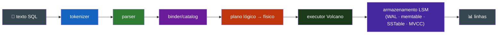
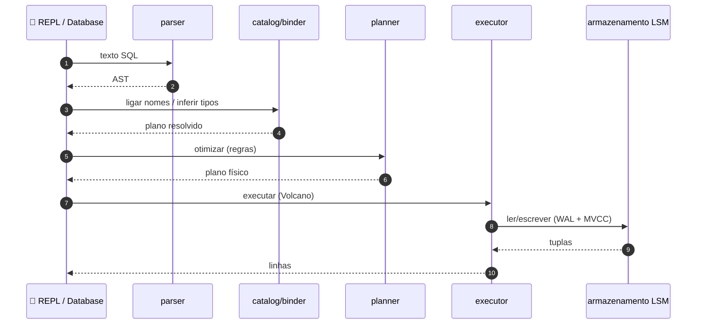

<div align="center">

**🌐 Choose Language / Selecione o Idioma / Elija el Idioma**

[](README.md)&nbsp;&nbsp;&nbsp;[](README_PT.md)&nbsp;&nbsp;&nbsp;[](README_ES.md)

</div>

---

<div align="center">

```
████████╗██╗████████╗ █████╗ ███╗   ██╗███████╗ ██████╗ ██████╗  ██████╗ ███████╗
╚══██╔══╝██║╚══██╔══╝██╔══██╗████╗  ██║██╔════╝██╔═══██╗██╔══██╗██╔═══██╗██╔════╝
   ██║   ██║   ██║   ███████║██╔██╗ ██║█████╗  ██║   ██║██████╔╝██║   ██║█████╗
   ██║   ██║   ██║   ██╔══██║██║╚██╗██║██╔══╝  ██║   ██║██╔══██╗██║   ██║██╔══╝
   ██║   ██║   ██║   ██║  ██║██║ ╚████║███████╗╚██████╔╝██║  ██║╚██████╔╝███████╗
   ╚═╝   ╚═╝   ╚═╝   ╚═╝  ╚═╝╚═╝  ╚═══╝╚══════╝ ╚═════╝ ╚═╝  ╚═╝ ╚═════╝ ╚══════╝
     Quatro grandes sistemas, escritos do zero em TypeScript real, em um monorepo
```

---

[](https://www.typescriptlang.org/)
[]()
[](LICENSE)
[]()
[]()

<br/>

> **Um banco de dados SQL embutido, uma plataforma de observabilidade, um framework web**
> **full-stack e um IDE de navegador — cada um escrito do zero, nenhum construído em cima**
> **de um banco, framework ou IDE existente. Inspiração, não dependência.**

<br/>


</div>

---

## 📑 Índice

<details>
<summary>▶️ <strong>Clique para expandir / contrair esta seção</strong></summary>

<table>
<tr>
<td valign="top" width="50%">

**🏗️ Sistema**
- [Visão Geral](#-vis%C3%A3o-geral)
- [Arquitetura do Sistema](#-arquitetura-do-sistema)
- [Stack Tecnológica](#-stack-tecnol%C3%B3gica)
- [Padrões de Projeto](#-padr%C3%B5es-de-projeto-aplicados)
- [Estrutura do Projeto](#-estrutura-do-projeto)

**📦 Módulos**
- [Motor SQL](#-motor-sql)
- [Observabilidade](#-observabilidade)
- [Framework Web](#-framework-web)
- [IDE de Navegador](#-ide-de-navegador)
- [Decisões de Design (ADRs)](#decis%C3%B5es-de-design-endere%C3%A7adas)

</td>
<td valign="top" width="50%">

**💼 Negócio**
- [Regras de Negócio](#-regras-de-neg%C3%B3cio)
- [Requisitos Funcionais](#-requisitos-funcionais)
- [Requisitos Não Funcionais](#-requisitos-n%C3%A3o-funcionais)

**📐 Design**
- [Modelo de Dados](#-modelo-de-dados)
- [Fluxos do Sistema](#-fluxos-do-sistema)
- [Fluxo de Statement SQL](#fluxo-de-statement-sql)
- [Substituições de Escopo](#substitui%C3%A7%C3%B5es-de-escopo)

**🔐 Segurança e Operações**
- [Segurança](#-seguran%C3%A7a)
- [Instalação & Execução](#-instala%C3%A7%C3%A3o--execu%C3%A7%C3%A3o)
- [Testes Automatizados](#-testes-automatizados)
- [Métricas & Monitoramento](#-m%C3%A9tricas--monitoramento)
- [Limitações Conhecidas](#-limita%C3%A7%C3%B5es-conhecidas)

</td>
</tr>
</table>

---

</details>

## 🌟 Visão Geral

<details>
<summary>▶️ <strong>Clique para expandir / contrair esta seção</strong></summary>

**TitanForge** — quatro grandes sistemas, escritos do zero em TypeScript real, em um monorepo.

Um banco de dados SQL embutido (tokenizer → parser → binder/catalog → planner baseado em regras → executor Volcano → armazenamento LSM com um WAL real e MVCC real) é o carro-chefe. Ao lado dele: uma plataforma de observabilidade (traces OTLP, um armazenamento de spans colunar real, uma linguagem de consulta escrita à mão), um framework web full-stack com seu próprio compilador baseado em `ts-morph` (roteamento por arquivo, data loaders realmente type-safe, SSR streaming), e um IDE de navegador (Monaco, um language service TypeScript real, um sistema de arquivos virtual, um shell com escopo, uma implementação real do Debug Adapter Protocol).

Nada aqui é construído em cima de um banco de dados, framework ou IDE existente — inspiração, não dependência.

### ✅ Status

Todo marco em `docs/ROADMAP.md` está completo: **717 testes, todos passando**, lint limpo, `tsc -b` limpo em todos os 22 pacotes. Toda redução deliberada de escopo está declarada claramente em `docs/ROADMAP.md` e nos ADRs — cada uma é um sistema genuinamente funcional por si só, apenas mais estreito do que a coisa que substitui. Nada neste README descreve algo que não está no repositório.

### 🎯 Objetivos do Sistema

| Objetivo | Descrição |
|-----------|-------------|
| 🗄️ **Banco de dados SQL embutido** | pipeline completo: tokenizer → parser → catalog → planner → executor → armazenamento LSM |
| 📈 **Plataforma de observabilidade** | traces OTLP, armazenamento colunar, linguagem de consulta à mão, flamegraph |
| 🕸️ **Framework full-stack** | compilador ts-morph, roteamento por arquivo, loaders type-safe, SSR streaming, dev server |
| 🧪 **IDE de navegador** | Monaco + language service TS, VFS, shell com escopo, implementação DAP real |
| 📐 **Um monorepo, zero código compartilhado** | quatro produtos independentes, convenções compartilhadas |
| 🤝 **Honesto sobre escopo** | toda substituição documentada como ADR, nunca falsificada |

---

</details>

## 🏗️ Arquitetura do Sistema

<details>
<summary>▶️ <strong>Clique para expandir / contrair esta seção</strong></summary>

### Quatro Produtos Independentes

```mermaid
flowchart TB
    subgraph SQL["🗄️ SQL — carro-chefe"]
        P1["parser"] --> C1["catalog/binder"]
        C1 --> PL1["planner (baseado em regras)"]
        PL1 --> E1["executor (Volcano)"]
        E1 --> S1["storage-api / memory / lsm (WAL+MVCC)"]
        E1 --> F1["engine (Database facade) + cli (REPL)"]
    end

    subgraph OBS["📈 Observabilidade"]
        P2["ingestão OTLP"] --> S2["armazenamento de spans colunar"]
        S2 --> Q2["linguagem de consulta à mão"]
        Q2 --> U2["service map + anomalia + flamegraph"]
    end

    subgraph WEB["🕸️ Framework web"]
        P3["compilador ts-morph"] --> R3["roteamento por arquivo + loaders + SSR"]
        R3 --> D3["dev server esbuild + WebSocket / HMR"]
    end

    subgraph IDE["🧪 IDE de navegador"]
        P4["sistema de arquivos virtual"] --> L4["ts.LanguageService + Monaco"]
        L4 --> SH4["shell com escopo + DAP + interpretador toy"]
    end

    style SQL fill:#1e3a5f,color:#fff,stroke:#4a90d9
    style OBS fill:#1a3a1a,color:#fff,stroke:#4caf50
    style WEB fill:#3a1a1a,color:#fff,stroke:#e57373
    style IDE fill:#2a1a3a,color:#fff,stroke:#ce93d8
```



### Design em Camadas (SQL)



---

</details>

## 🛠️ Stack Tecnológica

<details>
<summary>▶️ <strong>Clique para expandir / contrair esta seção</strong></summary>

| Camada | Tecnologia | Propósito |
|-------|-----------|---------|
| 🧠 **Linguagem** | TypeScript | todos os 22 pacotes |
| 📦 **Workspaces** | npm workspaces | um monorepo, produtos independentes |
| 🧪 **Testes** | Vitest | 717 testes em todos os pacotes |
| 🧹 **Lint** | ESLint | limpo em todos os pacotes |
| 🔍 **Build** | `tsc -b` | typecheck limpo em todos os pacotes |
| 🏗️ **Motor SQL** | @titanforge/engine | Database facade + armazenamento LSM |
| 🌐 **Observabilidade** | OTLP/JSON | armazenamento colunar + linguagem de consulta |
| 🕸️ **Compilador web** | ts-morph | roteamento por arquivo + extração de loader type-safe |
| 🧪 **IDE** | Monaco + ts.LanguageService | edição de navegador + features de linguagem |

---

</details>

## 📐 Padrões de Projeto Aplicados

<details>
<summary>▶️ <strong>Clique para expandir / contrair esta seção</strong></summary>

| Padrão | Onde | Justificativa |
|---------|-------|-----------|
| 🗃️ **Decomposição por estágios de pipeline** | SQL tokenizer → parser → catalog → planner → executor → storage | cada estágio transforma o anterior sem acoplar |
| 🧩 **AST de união discriminada** | parser SQL | finalização de caso type-safe e exaustiva |
| 🗄️ **Otimizador baseado em regras** | planner SQL | toda regra é uma melhoria de Pareto provável (ADR 4) |
| ⚙️ **Modelo de iterador Volcano** | executor SQL | streams pull-based compõem arbitrariamente |
| 📦 **Modelo de transação MVCC** | contrato storage-api do SQL | concorrência multi-versão entre motores |
| 🏗️ **Compilador sobre gerador** | parser + compilador web à mão | controle total, sem gerador opaco |
| 🖼️ **WAL + memtable + SSTable** | armazenamento LSM | durabilidade, escritas, compactação |
| 🤝 **ADRs de substituição de escopo honesta** | transversal | toda redução documentada, nunca falsificada |

---

</details>

## 📁 Estrutura do Projeto

<details>
<summary>▶️ <strong>Clique para expandir / contrair esta seção</strong></summary>

```
titanforge/
│
├── 📄 package.json / tsconfig.json / vitest.config.ts / eslint.config.js
├── 📄 tsconfig.base.json
├── 📄 README.md                   # 🇺🇸 English (principal)
├── 📄 README_PT.md                # 🇧🇷 Português
├── 📄 README_ES.md                # 🇪🇸 Español
│
├── 📂 packages/
│   ├── 📂 sql/                    # banco SQL embutido (carro-chefe, 411 testes)
│   │   ├── parser · catalog · planner · executor · engine · cli
│   │   └── storage-api · storage-memory · storage-lsm
│   ├── 📂 observability/          # traces, métricas, logs (110 testes)
│   ├── 📂 webstack/               # framework full-stack + compilador (162 testes)
│   │   └── example/              # app de exemplo funcional
│   └── 📂 ide/                    # IDE de navegador (145 testes)
│
├── 📂 docs/
│   ├── 📄 ARCHITECTURE.md        # como um statement SQL flui texto → linhas
│   ├── 📄 ROADMAP.md             # marcos, escopo e specs por produto
│   └── 📂 adr/
│       ├── 0001-monorepo-four-independent-products.md
│       ├── 0002-hand-written-parsers.md
│       ├── 0003-schema-catalog-as-a-system-table.md
│       ├── 0004-rule-based-not-cost-based-optimizer.md
│       └── 0005-honest-scope-substitutions.md
```

---

</details>

## 📦 Módulos do Sistema

<details>
<summary>▶️ <strong>Clique para expandir / contrair esta seção</strong></summary>

### 🗄️ Motor SQL

- `parser` — tokenizer à mão + parser recursivo descendente, AST de união discriminada.
- `catalog` — registro de schema + binder: resolve nomes, infere tipos, expande `SELECT *`.
- `planner` — plano lógico → otimizador baseado em regras (pushdown de predicado/projeção, seleção de estratégia de join) → plano físico.
- `storage-api` — a interface `StorageEngine` + o contrato MVCC compartilhado.
- `storage-memory` — um motor em memória realmente correto em MVCC.
- `storage-lsm` — um motor real de WAL + memtable + SSTable + compactação.
- `executor` — executor físico estilo Volcano, lógica real de NULL de 3 valores.
- `engine` — a facade `Database` — `execute`/`executeScript`/`transaction`.
- `cli` — um REPL.

### 📈 Observabilidade

Ingestão OTLP/JSON → um armazenamento de spans colunar real → uma linguagem de consulta escrita à mão (`service = "api" AND duration > 100`) → um construtor de service map + detector de anomalias → uma UI de flamegraph baseada em Canvas, além de um SDK de auto-instrumentação que envolve o `fetch`.

### 🕸️ Framework Web

Descoberta de rotas por arquivo baseada em `ts-morph` e extração de loaders type-safe (um arquivo de router gerado que faz type-check com zero diagnósticos), SSR streaming real fora de ordem, um dev server esbuild+WebSocket com HMR, e um sistema de plugins. Um app de exemplo funcional vive em `packages/webstack/example`.

### 🧪 IDE de Navegador

Um sistema de arquivos virtual com estrutura de árvore real, o `ts.LanguageService` próprio do TypeScript ligado ao Monaco, um terminal com escopo (`ls/cd/cat/mkdir/rm/run`, parsing real de comandos incluindo pipes e redirecionamento), e uma implementação real do Debug Adapter Protocol comprovada contra um interpretador de linguagem toy escrito do zero, com suporte a breakpoints.

---

</details>

## 📋 Regras de Negócio

<details>
<summary>▶️ <strong>Clique para expandir / contrair esta seção</strong></summary>

| # | Regra | Aplicação |
|---|------|-------------|
| BR-01 | Nada construído sobre banco/framework/IDE existente | inspiração, não dependência |
| BR-02 | Um monorepo, zero código compartilhado entre grupos | apenas convenções compartilhadas (ADR 1) |
| BR-03 | Parsers são escritos à mão, não gerados | controle total (ADR 2) |
| BR-04 | O catalog de schema persiste como linhas numa tabela de sistema | corrigido como `sqlite_master` do SQLite (ADR 3) |
| BR-05 | Otimizador é baseado em regras, não em custo | toda regra é uma melhoria de Pareto provável (ADR 4) |
| BR-06 | Correção MVCC faz parte do contrato de storage | compartilhada entre motores memory e LSM |
| BR-07 | Substituições de escopo são documentadas, nunca falsificadas | ADRs honestos para toda redução (ADR 5) |
| BR-08 | Type safety é provado, não assumido | arquivo de router gerado faz type-check com zero diagnósticos |
| BR-09 | Docs reais não omitem nada | "nada aqui descreve algo que não está no repo" |

---

</details>

## ✨ Requisitos Funcionais

<details>
<summary>▶️ <strong>Clique para expandir / contrair esta seção</strong></summary>

| ID | Requisito | Prioridade | Status |
|----|-------------|----------|--------|
| **RF-01** | Tokenizer + parser recursivo descendente → AST | 🔴 Alta | ✅ Implementado |
| **RF-02** | Binder/catalog: resolução de nomes, inferência de tipos, `SELECT *` | 🔴 Alta | ✅ Implementado |
| **RF-03** | Otimizador baseado em regras com pushdown + seleção de join | 🔴 Alta | ✅ Implementado |
| **RF-04** | Executor Volcano com lógica de NULL de 3 valores | 🔴 Alta | ✅ Implementado |
| **RF-05** | Armazenamento LSM: WAL + memtable + SSTable + compactação | 🔴 Alta | ✅ Implementado |
| **RF-06** | MVCC real entre motores memory e LSM | 🔴 Alta | ✅ Implementado |
| **RF-07** | REPL SQL + facade `Database` (execute/executeScript/transaction) | 🟡 Média | ✅ Implementado |
| **RF-08** | Ingestão OTLP + armazenamento colunar + linguagem de consulta | 🟡 Média | ✅ Implementado |
| **RF-09** | UI flamegraph + SDK de auto-instrumentação | 🟡 Média | ✅ Implementado |
| **RF-10** | Roteamento por arquivo + loaders type-safe + SSR streaming | 🔴 Alta | ✅ Implementado |
| **RF-11** | Dev server com HMR + sistema de plugins | 🟡 Média | ✅ Implementado |
| **RF-12** | Monaco + ts.LanguageService + VFS + shell com escopo + DAP | 🔴 Alta | ✅ Implementado |

---

</details>

## ⚙️ Requisitos Não Funcionais

<details>
<summary>▶️ <strong>Clique para expandir / contrair esta seção</strong></summary>

| ID | Categoria | Requisito | Alvo |
|----|----------|-------------|--------|
| **RNF-01** | 📦 Independência | zero dependência de banco/framework/IDE existente | do zero |
| **RNF-02** | 🧪 Correção | testes provam que os sistemas funcionam | 717 testes passando |
| **RNF-03** | 🔍 Type safety | `tsc -b` limpo | todos os 22 pacotes |
| **RNF-04** | 🧹 Lint limpo | ESLint limpo | todo pacote |
| **RNF-05** | 🧩 Modularidade | grupos de produtos independentes, convenções compartilhadas | design do monorepo |
| **RNF-06** | 📈 Escalabilidade | design LSM + colunar para tamanhos reais de dados | camadas de storage |
| **RNF-07** | 🤝 Honestidade | toda redução de escopo documentada | ROADMAP + ADRs |
| **RNF-08** | 🔍 Verificabilidade | alegações reproduzíveis a partir do repo | rode testes/build para confirmar |

---

</details>

## 🗄️ Modelo de Dados

<details>
<summary>▶️ <strong>Clique para expandir / contrair esta seção</strong></summary>

### Objetos do Pipeline SQL

| Estágio | Saída |
|-------|--------|
| Tokenizer | fluxo de tokens |
| Parser | AST de união discriminada |
| Binder/Catalog | schema resolvido, com tipos inferidos |
| Planner | plano lógico → físico |
| Executor | iteradores Volcano, NULL de 3 valores |
| Storage | WAL · memtable · SSTable · MVCC |

### Layout de Armazenamento (LSM)

| Componente | Propósito |
|-----------|---------|
| WAL | durabilidade para escritas |
| Memtable | escritas recentes em memória |
| SSTable | runs imutáveis ordenados |
| Compactação | mescla runs, limita amplificação de leitura |
| MVCC | concorrência multi-versão entre motores |

### Objetos de Observabilidade

| Objeto | Propósito |
|--------|---------|
| Spans OTLP | telemetria de trace |
| Armazenamento colunar | acesso analítico |
| Linguagem de consulta | `service = "api" AND duration > 100` |
| Service map / anomalia / flamegraph | análise e UI |

---

</details>

## 🔄 Fluxos do Sistema

<details>
<summary>▶️ <strong>Clique para expandir / contrair esta seção</strong></summary>

### Fluxo de Statement SQL



### Substituições de Escopo

| Substituição | Substitui | Status |
|--------------|---------------|--------|
| LanguageService TS real | um cross-compilado para WASM | ➕ Real, documentado |
| shell com escopo | WebContainers | ➕ Real, documentado |
| interpretador de linguagem toy | debugging real de V8 | ➕ Real, com breakpoints |
| OTLP apenas JSON | OTLP protobuf completo | ➕ Real, documentado |
| otimizador baseado em regras | otimizador baseado em custo | ➕ Melhorias de Pareto prováveis |

---

</details>

## 🔐 Segurança

<details>
<summary>▶️ <strong>Clique para expandir / contrair esta seção</strong></summary>

### Controles Implementados

| Controle | Implementação |
|---------|---------------|
| 🛡️ **Type safety como guarda** | `tsc -b` limpo; parsers e loaders tipados |
| 🧱 **Shell com escopo** | terminal do IDE é com escopo, com `ls/cd/cat/mkdir/rm/run` reais |
| 🧪 **Sem superfície de ataque de código compartilhado** | quatro produtos independentes, sem dependência entre grupos |
| 📚 **Documentado, não falsificado** | ADRs honestos garantem que nada supervaloriza |

### Considerações de Segurança Conhecidas

| Consideração | Detalhe |
|---------------|--------|
| 🌐 **Dev server** | dev server esbuild+WebSocket é para desenvolvimento |
| 🗃️ **Dados em repouso** | o motor SQL embutido armazena dados conforme seu contrato de storage; a operacionalidade é do consumidor |
| 🧪 **Interpretador toy** | o interpretador de demo do DAP é uma linguagem toy, não um runtime de código arbitrário |

---

</details>

## 🚀 Instalação & Execução

<details>
<summary>▶️ <strong>Clique para expandir / contrair esta seção</strong></summary>

### Instalar & Verificar

```bash
npm install
npm test          # 717 testes, todos os pacotes
npm run lint
npm run build     # tsc -b em todos os 22 pacotes
```

### Rodar um Grupo de Produto

```bash
npx vitest run packages/sql           # 411 testes (motor SQL)
npx vitest run packages/observability # 110 testes
npx vitest run packages/webstack      # 162 testes
npx vitest run packages/ide           # 145 testes
```

### REPL SQL

```bash
npx tsx packages/sql/cli/src/main.ts           # REPL interativo
npx tsx packages/sql/cli/src/main.ts -f script.sql  # não-interativo
```

---

</details>

## 🧪 Testes Automatizados

<details>
<summary>▶️ <strong>Clique para expandir / contrair esta seção</strong></summary>

```bash
npm test          # 717 testes, todos passando
npx vitest run packages/sql           # 411 testes
npx vitest run packages/observability # 110 testes
npx vitest run packages/webstack      # 162 testes
npx vitest run packages/ide           # 145 testes
```

Provas notáveis:

| Alegação | Provada por |
|-------|-----------|
| O pipeline SQL funciona de ponta a ponta | testes de integração contra o motor LSM real |
| O router gerado faz type-check | seu próprio teste, zero diagnósticos |
| O DAP funciona contra um debuggee real | breakpoints num interpretador toy do zero |
| O catalog de schema persiste | testado por integração contra LSM, não só memória (ADR 3) |

---

</details>

## 📊 Métricas & Monitoramento

<details>
<summary>▶️ <strong>Clique para expandir / contrair esta seção</strong></summary>

### Métricas do Código

| Métrica | Valor |
|--------|-------|
| Pacotes | 22 |
| Produtos | 4 (SQL, observability, webstack, ide) |
| Testes totais | 717 |
| Testes SQL | 411 |
| Testes Webstack | 162 |
| Testes IDE | 145 |
| Testes Observabilidade | 110 |
| Lint | limpo |
| `tsc -b` | limpo |

### Monitoramento (produto Observabilidade)

| Feature | Propósito |
|---------|---------|
| Armazenamento colunar | acesso analítico a traces |
| Linguagem de consulta | `service = "api" AND duration > 100` |
| Construtor de service map | descoberta de dependências |
| Detector de anomalias | detecção de outliers |
| UI flamegraph | perfil visual |

---

</details>

## ⚠️ Limitações Conhecidas

<details>
<summary>▶️ <strong>Clique para expandir / contrair esta seção</strong></summary>

| Categoria | Problema | Estado |
|----------|-------|--------|
| 🗄️ **Otimizador baseado em regras** | não é baseado em custo; não coleta estatísticas de tabela | ➕ Regras de Pareto prováveis (ADR 4) |
| 🌐 **OTLP apenas JSON** | não é OTLP protobuf completo | ➕ Substituição real e documentada |
| 🧪 **Interpretador de linguagem toy** | substitui debugging real de V8 | ➕ Real, com breakpoints (ADR 5) |
| 🖥️ **Shell com escopo** | substitui WebContainers | ➕ Real, documentado (ADR 5) |
| 🔤 **LanguageService real** | substitui um cross-compilado para WASM | ➕ Real, documentado (ADR 5) |
| 📦 **Sem código compartilhado** | quatro produtos independentes por design | ➕ Convenção sobre acoplamento (ADR 1) |

</details>

---

<div align="center">

---

### 🔨 TitanForge

*Quatro grandes sistemas, escritos do zero em TypeScript real, em um monorepo.*

[]()
[]()
[]()
[]()

<br/>

```
"Nada aqui descreve algo que não está no repositório."
```

</div>
